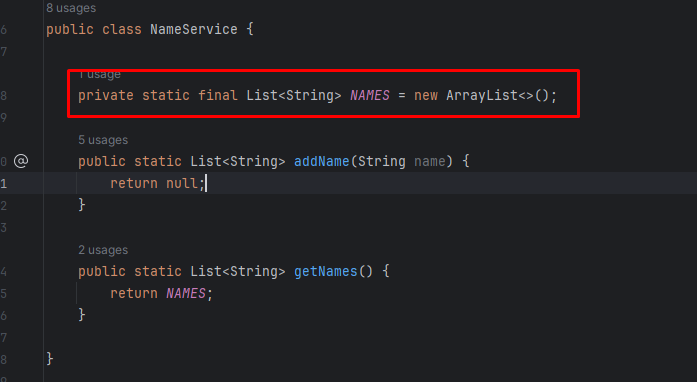

# ArrayList - HomeWork

В данной домашней работе нам необходимо будет реализовать простенькую программу которая будет имитировать скромную
базу данных на 10 имен.

Особенности реализации:

У нас имеется класс Main где происходит запуск программы и уже прописана логика по запуску программы и приему данных
от пользователя. Пользователь запускает программу и ему предлагают ввести имя. После того как он вводит имя ему на
экране должен высветиться список имен добавленных в базу данных и снова предложено ввести имя. При добавлении
следующего имени - оно так же должно добавляться в список и возвращаться уже список из двух имен.
Максимальный размер списка - 10 элементов. Если пользователь вводит 11 имя - ему должна вернуться ошибка
MemoryIsOverException.

Так же если пользователь вводит имя которое уже есть в базе данных - имя не должно добавляться снова.
Так же все добавляемые имена должны переводиться в верхний регистр при добавлении. Т.е. при добавлении имени "Алиса" 
в список должно добавиться имя "АЛИСА"

Всю логику по работе программы необходимо реализовать в классу NameService в методе:
public static List<String> addName (String name)

В качестве импровизированной базы данных используется статическая переменная NAMES. 

